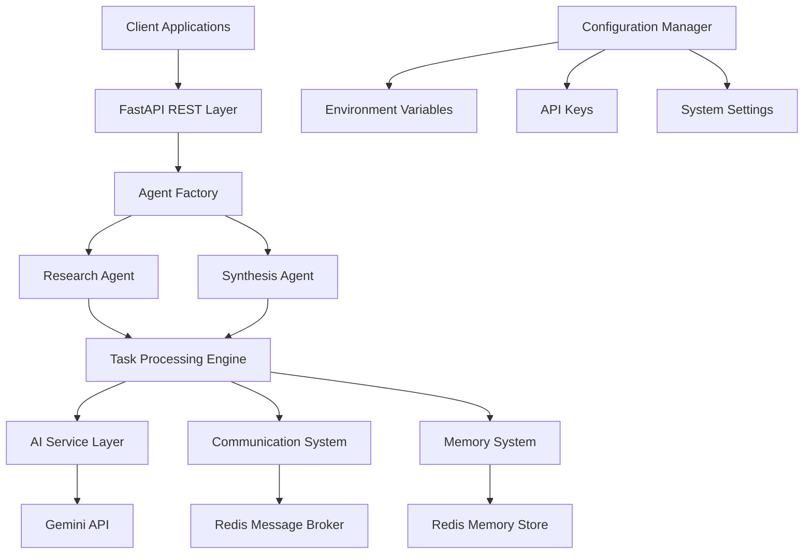
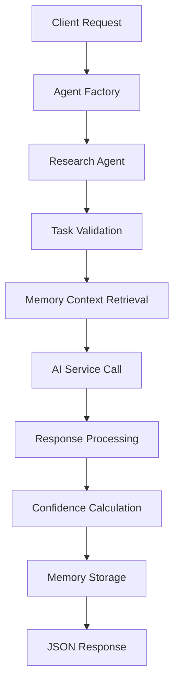
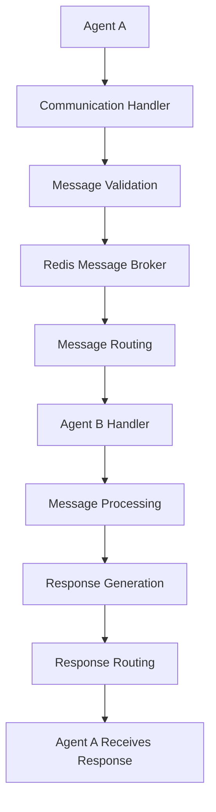

# System Architecture

## 🏗️ High-Level Architecture

The AI Agent Framework follows a modular, microservices-inspired architecture designed for scalability and maintainability.



## 🧩 Core Components

### 1. Agent Layer
**Location**: `agents/`
- **AgentFactory**: Creates and manages agent instances
- **ResearchAgent**: Handles research tasks and AI queries
- **SynthesisAgent**: Combines multiple sources for synthesis

### 2. Core Infrastructure
**Location**: `core/`
- **BaseAgent**: Abstract base class for all agents
- **AgentTypes**: Pydantic models for data validation
- **Exceptions**: Custom error handling

### 3. Communication System
**Location**: `communication/`
- **MessageBroker**: Redis-based message routing
- **CommunicationHandler**: Agent message management
- **Message Types**: Request/response, broadcast, direct messaging

### 4. Memory System
**Location**: `memory/`
- **MemoryStore**: Redis-backed persistent storage
- **MemoryHandler**: Memory operations and search
- **Memory Types**: Semantic, episodic, procedural

### 5. Configuration
**Location**: `config/`
- **Settings**: Environment configuration
- **GeminiConfig**: AI service configuration
- **RedisConfig**: Database configuration

## 🔄 Data Flow

### Research Agent Workflow


### Agent Communication Flow


## 🏛️ Architectural Principles

### 1. Separation of Concerns
- **Agents**: Business logic and AI interaction
- **Communication**: Message routing and delivery
- **Memory**: Data persistence and retrieval
- **Core**: Shared infrastructure and utilities

### 2. Dependency Injection
- Configuration injected through environment variables
- Services injected through factory patterns
- Easy testing through interface abstractions

### 3. Asynchronous Processing
- All operations are async/await compatible
- Non-blocking I/O for Redis and API calls
- Concurrent task processing capabilities

### 4. Error Resilience
- Graceful degradation on service failures
- Retry mechanisms for transient errors
- Comprehensive logging and monitoring

## 🗄️ Database Architecture

### Redis Usage Patterns

**1. Memory Storage**
```
Key Pattern: memory:{agent_id}:{memory_id}
Value: JSON serialized memory object
TTL: Configurable (default: 7 days)
```

**2. Message Broker**
```
Channels: agent:{agent_id}:inbox
Pub/Sub: Real-time message delivery
Message TTL: 1 hour default
```

**3. Task Queues**
```
Key Pattern: tasks:{agent_id}:{task_id}
Value: Task status and results
TTL: 24 hours default
```

## 🔐 Security Architecture

### Authentication & Authorization
- API key-based authentication for Gemini
- Redis password protection (configurable)
- Environment variable isolation

### Data Protection
- No sensitive data in logs
- Memory encryption at rest (Redis)
- Secure credential management

### Network Security
- Redis connection pooling
- TLS encryption for external APIs
- Container network isolation

## 📊 Performance Architecture

### Caching Strategy
- **Memory Cache**: Redis for fast retrieval
- **Task Results**: Temporary caching for quick access
- **Configuration**: In-memory caching for settings

### Scalability Design
- **Horizontal Scaling**: Multiple agent instances
- **Load Distribution**: Redis-based message queuing
- **Resource Optimization**: Connection pooling

### Monitoring Points
- **Agent Performance**: Task completion times
- **Memory Usage**: Redis memory utilization
- **API Latency**: Gemini API response times
- **Error Rates**: Failed operations tracking

## 🐳 Deployment Architecture

### Development Environment
```
Local Machine
├── Python Virtual Environment (Poetry)
├── Redis Container (Docker)
├── Application Code
└── Environment Configuration
```

### Production Environment
```
Docker Containers
├── Application Container
│   ├── AI Agent Framework
│   ├── FastAPI Server
│   └── Python Runtime
├── Redis Container
│   ├── Memory Storage
│   ├── Message Broker
│   └── Data Persistence
└── Reverse Proxy (Optional)
    ├── Load Balancing
    ├── SSL Termination
    └── Request Routing
```

## 🧪 Testing Architecture

### Test Categories
- **Unit Tests**: Individual component testing
- **Integration Tests**: Service interaction testing
- **End-to-End Tests**: Complete workflow testing
- **Performance Tests**: Load and stress testing

### Test Infrastructure
- **Organized Structure**: Tests grouped by functionality
- **JSON Validation**: Structured result verification
- **Automated Execution**: CI/CD compatible test runner
- **Error Simulation**: Fault tolerance testing

## 🔮 Extension Points

### Adding New Agent Types
1. Inherit from `BaseAgent`
2. Implement required abstract methods
3. Register with `AgentFactory`
4. Add configuration options

### Custom Memory Types
1. Extend `MemoryStore` interface
2. Implement storage/retrieval logic
3. Add validation schemas
4. Update search capabilities

### New Communication Patterns
1. Extend message types in `AgentTypes`
2. Implement handlers in `CommunicationHandler`
3. Add routing logic to `MessageBroker`
4. Update documentation

This architecture provides a solid foundation for building production-ready AI agent systems while maintaining flexibility for future enhancements. 